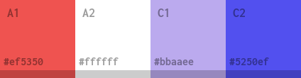
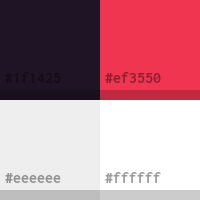
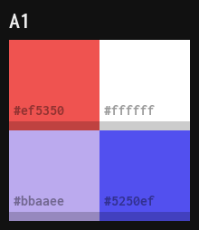

Swatch Maker
============

Create swatches from a list of colors.

## Usage

```bash
./swatchmaker.py 422x110 -c 1f1425 ef3550 eee fff
```


### Library Usage:

```python
from swatchmaker import Swatch, Filter

draw = Swatch.new(size=(422, 110), colors=['#1f1425', '#ef3550', '#eee', 'fff'])
im = draw([Filter.shadow(0.1, 0.2), Filter.label(16, 0.1)])
im.save('out.png')
```


## Examples

Shadow and color labels:
```bash
# --shadow SIZE OPACITY, -s SIZE OPACITY
#                       shadow size and opacity (values between 0.0 and 1.0)
# --label, -l           label colors with their hex value
swatch -c 1f1425 ef3550 eee fff -s .1 .2 -l -o out.png 422x110
```


Color names:

```bash
# --names [NAMES [NAMES ...]], -n [NAMES [NAMES ...]]
#                       names for color swatches (leave empty if using file input)
swatch -c ef5350 fff bbaaee 5250ef -s .1 .2 -l -n A1 A2 C1 C2 -o out.png 422x110
```



Multiple rows:
```bash
# --rows ROWS, -r ROWS  split swatches in N rows
swatch -c 1f1425 ef3550 eee fff -s .1 .2 -l -o out.png 200x200 -r 2
```



Border and title:

```bash
# --border SIZE COLOR, -b SIZE COLOR
# --title TITLE COLOR, -t TITLE COLOR
swatch -c ef5350 fff bae 5250ef -s .1 .2 -l -o out.png 200x200 -r 2 -b 10 111 -t A1 eee
```



## All Options:

```bash
positional arguments:
  size                  image width and height in pixels (ie 512x256)

optional arguments:
  -h, --help            show this help message and exit
  --input INPUT, -i INPUT
                        read colors from file
  --colors COLORS [COLORS ...], -c COLORS [COLORS ...]
                        list of colors (use instead of --input)
  --output OUTPUT, -o OUTPUT
                        output file
  --rows ROWS, -r ROWS  split swatches in N rows
  --shadow SIZE OPACITY, -s SIZE OPACITY
                        shadow size and opacity (values between 0.0 and 1.0)
  --label, -l           label colors with their hex value
  --names [NAMES [NAMES ...]], -n [NAMES [NAMES ...]]
                        names for color swatches (leave empty if using file input)
  --npos NPOS, -p NPOS  position for color name (0: top-left, 1: middle)
  --title TITLE COLOR, -t TITLE COLOR
                        a title text and color
  --border SIZE COLOR, -b SIZE COLOR
                        border size and color
  --fonts TITLE NAME LABEL, -f TITLE NAME LABEL
                        font sizes (title [-t], name [-n], label [-l])
```

